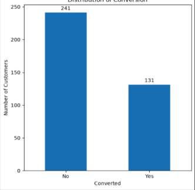
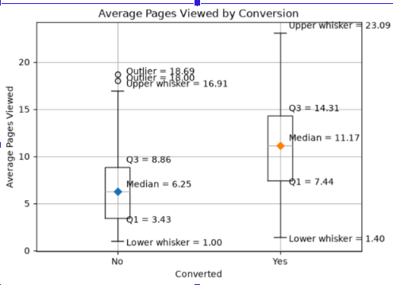
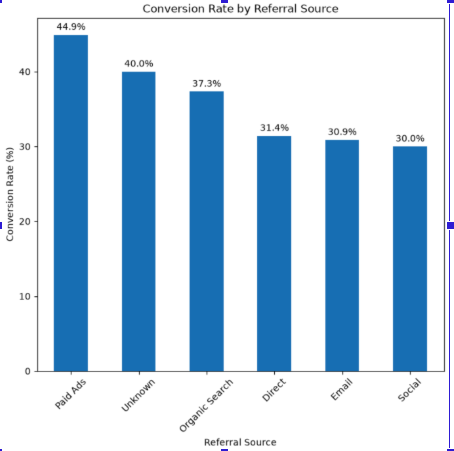

# Brightcart Customer Conversion Prediction

A machine learning classification project that predicts whether a website visitor will convert to a purchase.

## Business Problem

Brightcart wants to identify website visitors who are more likely to make a purchase so that marketing teams can improve retargeting and use advertising budgets more efficiently.

The project predicts a binary target:

- **Yes** — customer converts
- **No** — customer does not convert

## Dataset

The project uses customer, session, and marketing interaction data.

| Dataset | Rows | Columns | Purpose |
|---|---:|---:|---|
| customer_master.csv | 437 | 5 | Customer information |
| session_logs.csv | 4,049 | 5 | Website session activity |
| marketing_touchpoints.csv | 1,835 | 5 | Marketing interactions |
| converted_labeled.csv | 372 | 2 | Training labels |
| converted_to_predict.csv | 65 | 1 | Customers requiring predictions |

The datasets are joined using `customer_id`.

## Approach

The project follows these main steps:

1. Load and inspect the raw datasets.
2. Merge customer information with conversion labels.
3. Clean missing and invalid data.
4. Aggregate session-level data to customer level.
5. Aggregate marketing touchpoints to customer level.
6. Encode categorical variables using one-hot encoding.
7. Apply Min-Max normalization to numerical features.
8. Split the data into training and testing sets using stratified sampling.
9. Train and compare multiple classification models.
10. Evaluate the models using accuracy, precision, recall, F1-score, and a confusion matrix.
11. Select the final model and predict conversion for the 65 customers in `converted_to_predict.csv`.

## Feature Engineering

Session-level data was aggregated for each customer using:

- Total sessions
- Total pages viewed
- Average pages viewed per session
- Maximum pages viewed in a session
- Total bounced sessions
- Bounce rate

Marketing data was aggregated using:

- Total marketing touchpoints
- Average response time
- Minimum response time
- Maximum response time
- Number of Email interactions
- Number of Push Notification interactions
- Number of Retarget Ad interactions
- Number of SMS interactions
- No-marketing indicator

## Data Cleaning

Several data-quality issues were addressed:

- Missing `region` values were replaced with `Unknown`.
- Missing `referral_source` values were replaced with `Unknown`.
- Negative `pages_viewed` values were treated as invalid and replaced with missing values.
- Missing page-view values were median-imputed.
- Duplicate session records were removed.
- Missing marketing response times were median-imputed.
- Valid high page-view values were retained because they may represent genuine customer behavior.

## Models Tested

The following classification algorithms were evaluated:

- Logistic Regression
- Decision Tree
- Random Forest
- K-Nearest Neighbors (KNN)
- Support Vector Machine (SVM)
- Gradient Boosting
- AdaBoost
- Gaussian Naive Bayes
- Tuned AdaBoost

## Model Results

| Model | Accuracy | Precision | Recall | F1 |
|---|---:|---:|---:|---:|
| AdaBoost Tuned | **77.33%** | **69.57%** | 61.54% | **65.31%** |
| AdaBoost | 74.67% | 62.96% | **65.38%** | 64.15% |
| Random Forest | 73.33% | 60.71% | **65.38%** | 62.96% |
| Gradient Boosting | 70.67% | 57.69% | 57.69% | 57.69% |
| Naive Bayes | 68.00% | 53.85% | 53.85% | 53.85% |
| Logistic Regression | 68.00% | 54.17% | 50.00% | 52.00% |
| Decision Tree | 66.67% | 51.72% | 57.69% | 54.55% |
| SVM | 66.67% | 53.33% | 30.77% | 39.02% |
| KNN | 57.33% | 28.57% | 15.38% | 20.00% |

## Baseline

A majority-class baseline was used for comparison.

Since approximately 66% of the training examples are `No`, a classifier that always predicts `No` would achieve approximately 66% accuracy.

The tuned AdaBoost model achieved **77.33% accuracy**, exceeding this baseline.

## Final Model

The final model selected was **Tuned AdaBoost** with:

- `n_estimators = 100`
- `learning_rate = 0.2`

Test performance:

- **Accuracy:** 77.33%
- **Precision for Yes:** 69.57%
- **Recall for Yes:** 61.54%
- **F1-score for Yes:** 65.31%

The F1-score was emphasized because it balances precision and recall for the conversion class. Recall was also considered important because missing an actual converter represents a potential lost sales opportunity.

## Confusion Matrix

For the tuned AdaBoost model:

- True Negatives: 42
- False Positives: 7
- False Negatives: 10
- True Positives: 16

The model correctly identified 16 of the 26 actual converters in the test set.

There were 10 false negatives, meaning some customers who converted were incorrectly predicted as non-converters.

## Key Findings

### 1. Target Distribution

The dataset is moderately imbalanced, with approximately:

- 66% Non-converters
- 34% Converters

### 2. Pages Viewed and Conversion

Customers who converted generally viewed more pages per session.

The median pages viewed per session was:

- **11.17 for converters**
- **6.25 for non-converters**

This suggests that higher browsing engagement is associated with a greater likelihood of conversion.

### 3. Referral Source

Conversion rates varied by referral source.

- Paid Ads: **44.9%**
- Unknown: **40.0%**
- Organic Search: **37.3%**
- Direct: **31.4%**
- Email: **30.9%**
- Social: **30.0%**

This suggests that referral source can provide useful information for predicting conversion.

## Key Visualizations

### 1. Distribution of Conversion

This chart shows the distribution of converted and non-converted customers, highlighting the moderate class imbalance in the dataset.




### 2. Pages Viewed by Conversion

This chart compares pages viewed per session between converters and non-converters. Converters show higher browsing engagement, with a median of 11.17 pages compared with 6.25 for non-converters.




### 3. Conversion Rate by Referral Source

This chart shows how conversion rates vary across different referral sources. Paid Ads had the highest conversion rate at 44.9% 
 while Social had the lowest at 30.0%.




## Business Benefit

The model can help Brightcart's marketing and customer-retention teams:

- Identify customers more likely to convert.
- Prioritize higher-potential customers for retargeting.
- Allocate advertising budgets more efficiently.
- Reduce unnecessary targeting of customers less likely to convert.
- Use customer browsing and marketing engagement information to improve targeting decisions.

Predictions could be generated periodically, such as daily or weekly, using updated customer activity.

## Challenges

### Challenge 1 — Data Cleaning

**Problem:** Session data contained negative `pages_viewed` values and duplicate records.

**Solution:** Negative values were treated as invalid and replaced with missing values, then median-imputed. Duplicate session records were removed.

**Result:** The session data was cleaned while valid high page-view values were retained.

### Challenge 2 — Data Preparation

**Problem:** Several features contained missing values, including `region`, `referral_source`, and marketing response times.

**Solution:** Categorical missing values were replaced with `Unknown`, while numerical missing values were median-imputed. Categorical variables were one-hot encoded and numerical variables were Min-Max scaled.

**Result:** A consistent model-ready dataset was produced.

### Challenge 3 — Model Selection

**Problem:** The classification models produced substantially different results. For example, KNN achieved only 15.38% recall for the conversion class.

**Solution:** Multiple models were tested and AdaBoost was manually tuned.

**Result:** Tuned AdaBoost achieved the best overall accuracy and F1-score.

## Limitations

The model can identify customers who are more likely to convert, but it cannot guarantee that a customer will purchase.

The dataset is relatively small, so model performance may vary when applied to a larger or different population.

The model also produces some false negatives, meaning some actual converters are missed.

## Future Improvements

With more time, the project could be improved by:

1. Performing more extensive hyperparameter tuning with cross-validation.
2. Creating additional customer-level features from available session and marketing data.
3. Testing probability thresholds or class weighting to improve recall for converters.
4. Evaluating the model on a larger dataset.

## Tech Stack

- **Python 3.x**
- **Pandas** — data loading, cleaning, merging, and feature engineering
- **Scikit-learn** — preprocessing, machine learning models, and evaluation
- **Matplotlib** — data visualization
- **Jupyter Notebook** — development and analysis

## Project Structure

```text
01_Brightcart_Classification/
│
├── Brightcart_Classification.ipynb
├── customer_master.csv
├── session_logs.csv
├── marketing_touchpoints.csv
├── converted_labeled.csv
├── converted_to_predict.csv
└── README.md
